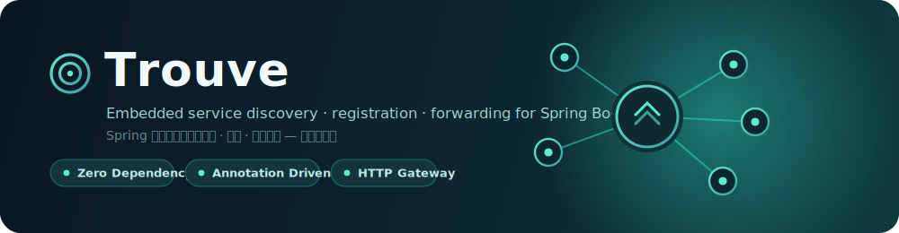
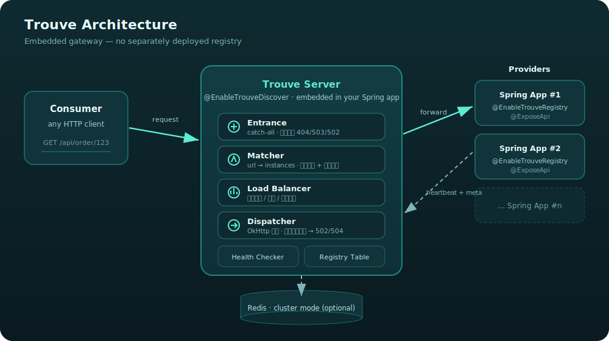

<p align="center">
  
</p>

<p align="center">
  <b>简单、方便、快捷。</b>服务于 Spring 项目的一款<b>内嵌式集成服务发现、服务注册、服务转发</b>通用组件 —
  相比需要独立部署的 Zookeeper / Nacos / Eureka，使用和部署更加简易方便。
</p>

<p align="center">
  <a href="https://www.apache.org/licenses/LICENSE-2.0.html"></a>
  
  
  
  
</p>

<p align="center"><a href="../README.md">English</a></p>

--------

## 为什么用 Trouve

Trouve 把注册中心**内嵌进你自己的 Spring Boot 应用**：服务提供方用一个注解暴露 API，
Trouve 服务端（同样只是一个 Spring 应用）发现它们并转发流量 —— 于是你无需额外搭建和运维一套独立集群，
就同时获得了服务发现与一个 HTTP 网关。

| | **Trouve** | Nacos | Eureka | Zookeeper |
| --- | :---: | :---: | :---: | :---: |
| 需独立部署注册中心 | **不需要**（内嵌） | 需要 | 需要 | 需要 |
| 服务注册 | 注解 `@EnableTrouveRegistry` | SDK / 配置 | SDK | 客户端方案 |
| 暴露 API | `@ExposeApi` | 无 | 无 | 无 |
| 内置请求转发 | **支持**（网关） | 不支持 | 不支持 | 不支持 |
| 集群模式 | Redis（可选） | Raft | 节点复制 | ZAB |

## 架构

<p align="center">
  
</p>

- **服务提供方**定时把心跳与暴露的 API 元信息注册到 Trouve 服务端。
- **Trouve 服务端**维护 `url → 实例` 路由表，对实例做健康检查；每次请求时**匹配**路由、
  在健康实例间**负载均衡**、再经 OkHttp **转发**。
- 默认**单机模式**；开启 **Redis 集群模式**可在多个服务端节点间共享状态。

--------

## 零配置（Spring Boot starter）

Trouve 支持**纯属性自动装配，无需任何 `@Enable...` 注解**。下方基于注解的用法依然有效，且两者同时存在时注解优先。

**服务提供方** —— 设置服务名与服务端地址，再用 `@ExposeApi` 标注要暴露的 API：

```properties
trouve.client.service-name=my-service
trouve.server.address=http://127.0.0.1:8279
```

**服务端** —— 设置命名空间；可选自动注册转发入口，免去手写 `EntranceController`：

```properties
trouve.server.namespace=openapi
# 可选：自动注册 catch-all 转发入口（默认 false）
trouve.server.auto-entrance=true
```

--------

## 快速开始 —— Client 端

### 1. 在 pom.xml 中引入依赖

```xml
<dependency>
    <groupId>com.lei6393.trouve</groupId>
    <artifactId>trouve-client</artifactId>
    <version>1.1.0</version>
</dependency>
```

### 2. 在 Spring 启动类上加入注解

```java
@EnableTrouveRegistry(
        value = "test_service_name",  // service name，每个接入服务需要单独起名字
        serverAddresses = @ServerAddress(schema = "http", host = "127.0.0.1", port = 8279) // trouve 服务端地址，从配置优先获取，配置为空则使用注解
)
@SpringBootApplication
public class ClientTestApp {

    public static void main(String[] args) {
        SpringApplication application = new SpringApplication(ClientTestApp.class);
        // 设置默认端口
        application.setDefaultProperties(Collections.<String, Object>singletonMap("server.port", "8278"));
        application.run(args);
    }
}
```

### 3. 在需要暴露的 RestController 或 API 上加 `@ExposeApi`

- 加在 class 上：暴露该类里所有 API。
- 加在方法上：只暴露该 API。

```java
// expose all
@RestController
@RequestMapping("/expose/all")
@ExposeApi
public class ExposeAllMethodController {

    @RequestMapping(value = "/{path}/one", produces = "application/json")
    @ResponseBody
    public String testMethod1() {
        return "{\"message\":\"success call client service\"}";
    }

    @RequestMapping(value = "/{path}/two", produces = "application/json")
    @ResponseBody
    public String testMethod2() {
        return "{\"message\":\"success call client service\"}";
    }
}


// expose alone
@RestController
@RequestMapping("/expose/alone")
public class ExposeAloneMethodController {

    @RequestMapping(value = "/{path}/true", produces = "application/json")
    @ResponseBody
    @ExposeApi
    public String testMethodOne() {
        return "{\"message\":\"success call client service\"}";
    }

    @RequestMapping(value = "/{path}/false", produces = "application/json")
    @ResponseBody
    public String testMethodTwo() {
        return "{\"message\":\"success call client service\"}";
    }
}
```

### 4. 支持配置的属性

```properties
# trouve 支持自动获取 IP，如果自动获取的 IP 无法使用，可通过该属性指定 IP
trouve.client.ip=168.0.0.1

# trouve 支持自动获取 port（依赖 spring 默认配置 server.port），如果自动获取的 port 无法使用，可通过该属性指定 port
trouve.client.port=8888

# spring 默认暴露端口，会优先获取该端口
server.port= 9999

# 优先获取的 trouve 服务端地址，支持传多个值，用 "," 分割
trouve.server.address=http://127.0.0.1:8888
```

--------

## 快速开始 —— Server 端

### 1. 引入依赖包

```xml
<dependency>
    <groupId>com.lei6393.trouve</groupId>
    <artifactId>trouve-server</artifactId>
    <version>1.1.0</version>
</dependency>
```

### 2. 在启动类加入注解 `@EnableTrouveDiscover("openapi")`

```java
@SpringBootApplication
@EnableTrouveDiscover("openapi")
public class ServerSingletonTestApp {

    public static void main(String[] args) {
        SpringApplication application = new SpringApplication(ServerSingletonTestApp.class);
        // 设置默认端口
        application.setDefaultProperties(Collections.<String, Object>singletonMap("server.port", "8279"));
        application.run(args);
    }
}
```

必填项为 namespace，每一个 server 服务要设置一个唯一值。

### 3. 配置服务转发的入口：`TrouveRequestDispatcher.entrance(request, response)`

```java
@RestController
public class EntranceController {

    @RequestMapping("/**")
    public void entrance(HttpServletRequest request,
                         HttpServletResponse response) throws Throwable {
        TrouveRequestDispatcher.entrance(request, response);
    }
}
```

### 4. 集群模式

- trouve 的 server 端默认开启单机模式。
- 如需开启集群模式（通过 Redis 实现），配置如下参数：

```properties
# 开启标识
trouve.server.redis.enable=true
# redis 地址
trouve.server.redis.singleServer=127.0.0.1:6379
# redis 密码，如果没有可不填
trouve.server.redis.password=123456
```

--------

## 模块说明

| 模块 | 职责 |
| --- | --- |
| `trouve-core` | 共享数据模型（Instance / Meta / ServiceInfo）、工具、异常、事件 |
| `trouve-client` | `@EnableTrouveRegistry` + `@ExposeApi`；定时心跳与元信息上报 |
| `trouve-server` | `@EnableTrouveDiscover`；路由表、健康检查、负载均衡、请求转发 |
| `trouve-examples` | 可运行的 client / 单机 server / 集群 server 示例 |

## 许可证

基于 [Apache License 2.0](../LICENSE) 开源。
