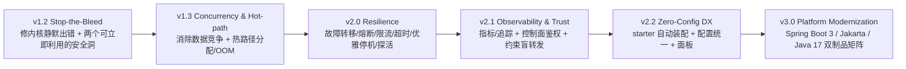

# Trouve 优化迭代路线图（大版本规划）

> 生成日期：2026-06-19 ｜ 当前版本：v1.1.0 ｜ 方法：5 视角架构师独立提案 → 对抗式评审 → 综合
>
> 本文是一份**新的**规划文档，所有结论均经子代理在真实代码中抽查验证。

  

---

## 实施进度（截至 2026-06-19）

| 版本 | 状态 | 说明 |
| --- | --- | --- |
| **v1.2 Stop-the-Bleed** | ✅ 已实现 | 全部 8 项落地 + 回归测试 |
| **v1.3 Concurrency & Hot-path** | ✅ 核心已实现 | Matcher 并发化 + 快照 + 路由缓存、HealthChecker fail-open 修复、3×Timer→线程池；body 流式/JMH harness 推迟 |
| **v2.0 Resilience** | ✅ 基本完成 | ✅ retry-with-failover、✅ 按实例熔断器、✅ 入口并发限流、✅ 请求体体积守护(413)、✅ 优雅停机(drain)、✅ 主动 HTTP 探活(滞回)；按路由超时待办 |
| **v2.1 Observability & Trust** | ✅ 基本完成 | ✅ 控制面共享令牌鉴权、✅ 内置指标 + `/metrics` + `/prometheus` 文本格式、✅ 管理面板 `/dashboard`、✅ trace 透传(traceparent/b3 + X-Request-Id)、✅ 未匹配 404；Micrometer 原生绑定待办 |
| **v2.2 Zero-Config DX** | 🟡 大部分 | ✅ spring-boot-starter 自动装配（client+server，properties-only，**Spring 上下文集成测试验证**）、✅ 可选自动注册转发入口、✅ spring-configuration-metadata IDE 补全；统一 @ConfigurationProperties / 面板待办 |
| **v3.0 Platform Modernization** | ⬜ 刻意未做 | Boot3/Jakarta 为**破坏性**迁移（javax→jakarta 会破坏当前 Boot2 构建），需 Maven profile + Boot2/Boot3 双制品矩阵才能不伤存量用户；非 in-place 能完成，留作独立分支阶段。非破坏性前置（可插拔 HttpClient、jacoco 覆盖率门禁、OWASP 扫描）可先行 |

已验证：`mvn package`（Java 11）全模块 BUILD SUCCESS，**48 个回归测试全绿**（含 starter 自动装配的真实 Spring 上下文集成测试）。
所有新增韧性/安全/可观测/DX 能力**默认关闭或行为兼容**，不破坏既有 happy path。
**修复**：v2.1 引入的 `EnvUtil` 时序 bug（`EnvUtil.setEnvironment` 须先于读取注解信息，否则服务端启动期 token 读取 NPE）已修正。
代码改动覆盖 dispatch（含 resilience / metrics 子包）/ consistency / loadbalance / controller / auth / client sender / 自动装配 + core 工具 + pom + starter 资源。

---

## 一、北极星（Vision）

把 trouve 从"**能用但内核会静默出错**"的内嵌式服务发现 + 转发组件，演进为
**先正确可信 → 再安全韧性 → 再现代化可规模**的生产级嵌入式网关。

继续以"**免独立部署**"为差异化卖点对标 Nacos / Eureka，但守住三条底线：

1. **数据面**永不静默丢包 / 返回假 200 / 并发崩溃；
2. **控制面**默认鉴权、无反序列化 RCE；
3. 在 **Spring Boot 3 / Jakarta** 生态可运行，且每次演进都可度量、可回归、可被运维信任。

**排序原则**：先稳内核 → 再补韧性与安全 → 再升 Boot3 生态 → 再做性能与规模化；DX 与可观测性贯穿全程。

---

## 二、版本总览

| 版本 | 代号 | 主题 | 性质 | 依赖 |
| --- | --- | --- | --- | --- |
| **v1.2** | Stop-the-Bleed | 正确性 + 两项安全急救 | 补丁（不破坏 happy path） | 起点 |
| **v1.3** | Concurrency & Hot-path | 并发安全 + 热路径性能 | 补丁 | v1.2 |
| **v2.0** | Resilience | 网关韧性原语（首个特性大版本） | 新增特性 | v1.2 + v1.3 |
| **v2.1** | Observability & Trust | 指标 / 追踪 / 鉴权 / 约束转发 | 新增特性 | v2.0 |
| **v2.2** | Zero-Config DX | starter / 配置统一 / 面板 | 新增特性 | v2.1 |
| **v3.0** | Platform Modernization | Boot3 / Jakarta / Java 17 | 破坏性（双制品保护存量） | v1.2–v2.2 测试套件 |

---

## 三、P0 立即修复（Quick Wins，建议先行/并入 v1.2）

这些是**确凿、低成本、高收益**的修复，子代理已在代码中逐一定位：

| # | 问题 | 位置 | 修法 |
| --- | --- | --- | --- |
| 1 | **重试数学反了**，`Math.min(retryCount,0)` 恒 ≤0 → 重试永不生效 | `AbstractDispatchCenterProcessor.execute()` 第 65 行 | 改 `Math.max`；并补 `retryCount` 配置写入链路（默认 0 且无 setter，否则仍是死代码） |
| 2 | **集群模式 JDK 反序列化 RCE** | `RedisConsistencyConfiguration.java:37` `new SerializationCodec()` | 换 `JsonJacksonCodec` / 与 Gson 对齐的安全 codec |
| 3 | **转发全失败时返回假成功**（近空 200 而非 502/504） | `execute()` 第 68/91 行 | 重试耗尽置 502/504 或重抛类型化异常 |
| 4 | **Matcher 读路径 NPE**（`get()` 返回 null 直接进构造器/`removeIf`） | `Matcher.java:70,113` | null 守护：miss 返回空 List / no-op |
| 5 | **健康检查 fail-open**（首次 flush 前所有实例被判健康） | `AbstractHealthChecker.java:45` | unknown = 保留上次好集合 |
| 6 | **客户端无故障转移**（`findAny().get()` 随机钉死一个注册中心，空 Optional 还抛异常） | `AbstractSender.realAddress()` | 失败时迭代其余地址 |
| 7 | **懒加载无同步**（并发首请求建多个 OkHttpClient / null policy NPE） | `DispatchNetworkHelper.getClient()`、`Balancer.policy` | 饿汉或 `volatile`+双检锁 |
| 8 | **孤儿 fastjson 1.2.83 死属性**（无 import、无依赖声明，仅供应链/扫描噪音） | `pom.xml:32` | 删除，JSON 统一由 Gson |

---

## 四、大版本详解

### v1.2 — Stop-the-Bleed（修内核静默出错 + 安全急救）

> 纯正确性 + 两项低成本安全急救，让网关永不静默返回假 200 / 并发 NPE，并堵住 RCE 与未鉴权控制面的最危险缺口。

- 修复重试数学并打通 `retryCount` 配置链路（`S`/critical）
- `execute()` 总失败产出 502/504 而非假成功；每次尝试 drain/close Response 防连接池毒化（`M`/critical）
- 为 entrance 加 `@ControllerAdvice` 全局异常边界：空实例→503、未注册 url→404、上游 IO→502/504（`M`/high）
- Matcher 读路径 null 守护（线程安全留待 v1.3）（`S`/critical）
- 替换 `SerializationCodec` 消除集群反序列化 RCE（`S`/critical）
- 删死 fastjson 属性 + `getClient()`/`Balancer.policy` 安全初始化（`S`/high）
- 客户端 `realAddress()` 故障转移 + `AbstractSender` 确定性重试（`M`/high）
- 落地最小 JUnit + 并发回归套件（现仅 3 个零散 test，且 UDPSender/ChannelTest 是 socket 探针非断言）（`M`/high）

**完成判定**：`retryCount>0` 时重试实际执行且有测试覆盖；matcher miss/replace 返回空而非 NPE；上游强制失败产出 502/504；三个 Trouve 异常映射正确状态码；首个注册地址宕机时 failover；集群模式不再用 JDK 序列化 codec；`dependency:tree` 无 fastjson；CI 绿、happy path 行为不变。

### v1.3 — Concurrency & Hot-path（消除数据竞争 + 热路径开销）

> 让共享可变状态在并发下安全，把每请求重建的匹配开销与整体缓冲的内存压下去。

- **Matcher 改并发结构 + 不可变快照原子换**（现为 `HashMap`+可变 `HashSet`，timer 写/请求读无锁，`volatile` 仅护引用换不护嵌套内容）（`L`/critical）
- **缓存 / 建路由索引**（`getBastMatchUri` 每个非精确命中请求都 `keySet().toArray()`+`new PatternsRequestCondition()`，O(routes) 分配+Ant 解析）（`M`/high）
- **请求/响应体流式转发 + 最大体积限制**（`IOUtils.toByteArray()` 与 `responseBody.bytes()` 双重堆物化 → 并发大文件 OOM）（`L`/critical）
- **三处 `java.util.Timer` 统一为共享 `ScheduledThreadPoolExecutor`**（单线程、任务抛 Throwable 即永久死线程，静默停掉心跳/健康/刷新）（`M`/high）
- 修复 HealthChecker fail-open 默认 + `initialized` 标志原子 swap（`M`/high）
- 有状态负载均衡策略线程安全（`AtomicInteger`）+ 引入 JMH/wrk 性能基线 harness 作回归门禁（`M`/medium）

**完成判定**：≥8 读线程 + 写线程 ≥60s 压测零 CME/NPE、路由视图稳定；profiler 显示匹配条件不再每请求重建；并发大 body 堆占用平稳无 OOM；无 `java.util.Timer` 残留且单任务异常不停掉后续 tick；基线 p99/分配数据入库为门禁。

### v2.0 — Resilience（网关韧性原语 · 首个特性大版本）

> 在正确无竞争的内核上加齐网关必备韧性原语。

- **重试改为换实例故障转移 + 退避**（现重放同一 Instance/同一 request，死 pod 被锤 N 次仍失败；默认仅幂等方法重试）（`L`/critical）
- **按实例熔断器 + 自动摘除 / 半开恢复**（复用 `DispatchResponseTimeWindow`）（`L`/high）
- **入口并发限制 + 限流**（`@RequestMapping("**")` 无界盲转发可耗尽线程；饱和 429/503 削峰）（`M`/high）
- **按路由超时**叠加在全局 OkHttp 超时之上（`M`/medium）
- **优雅停机/注销**（client 仅单次尽力 delete、server 无 drain；对接 Spring lifecycle/preStop）（`M`/high）
- **主动 HTTP 健康探活 + 抖动滞回**（独立有界执行器，排在熔断摘除之后使结果有处可落）（`L`/high）
- 韧性配置经 `@ConfigurationProperties` 暴露并文档化（`M`/medium）

**完成判定**：故障注入杀掉上游之一，幂等调用 failover 后成功率≈100%；持续失败实例被摘除并在恢复后重新纳入；负载尖峰被削峰；SIGTERM 在 deadline 内 drain 并确认注销；心跳活但探活失败的实例被摘除；抖动上游经滞回稳定；所有旋钮文档化。

### v2.1 — Observability & Trust（让失败可见 + 锁住信任边界）

> 暴露指标与追踪，并关闭未鉴权控制面与开放转发。

- 转发面与注册面 **Micrometer/Prometheus 指标**（在 `DispatchInterceptorRegistry` 的 postProcess/onProcessError 天然埋点位）（`L`/high）
- **W3C `traceparent`/B3 追踪上下文透传**，缺失时补 correlation id，发网关 span（`M`/medium）
- **控制面 client↔server 鉴权**（共享 token 最小可用，mTLS 可选）（`L`/critical）
- **约束 entrance 盲 `**` 转发**：限制到已注册路由前缀，未匹配快速 404，防 SSRF/开放中继（`M`/high）
- `ManagerController` 扩展为只读管理 API（现仅 1 个端点）作为面板数据底座（`M`/medium）

**完成判定**：Prometheus 抓取到请求/重试/熔断/健康/限流指标；trace id 端到端穿过网关跳；无合法 token 的注册/心跳被拒；entrance 对未注册路径不转发直接 404；管理 API 鉴权后渲染实时路由/健康。

### v2.2 — Zero-Config DX（让 trouve 60 秒可采纳）

> 内核已正确/韧性/可观测后，把采纳摩擦降到零。

- **提供 `spring-boot-starter` 自动配置**（全仓无 `spring.factories`/`AutoConfiguration.imports`，`@Enable` 注解目前是强制的——对标 Nacos/Eureka DX 的最大杠杆）（`L`/high）
- **自动注册 catch-all `EntranceController`**（现每个 server 示例都手抄相同样板）（`M`/high）
- **全部旋钮绑定 `@ConfigurationProperties` + IDE 元数据**（现配置散落注解属性/env 变量/properties 三处）（`L`/high）
- 零配置默认 + quickstart 示例（`M`/medium）
- 可选轻量管理面板（Tabler 图标，适配配色）+ README 重写为可粘贴 quickstart + vs-Nacos/Eureka 对比表（`L`/medium）

**完成判定**：新用户加一个 starter 依赖、`application.yml` 设 namespace 即可启动并完成注册+转发，零 `@Enable`、零手抄 EntranceController；quickstart 在 CI 编译运行；面板展示实时路由/健康。

### v3.0 — Platform Modernization（Spring Boot 3 / Jakarta / Java 17）

> 在有完整测试套件护栏后做最具破坏性的平台迁移。

- **Spring Boot 2.2.13(EOL)→2.7→3.2 跳板迁移**（`XL`/high）
- **`javax.*` → `jakarta.*` 全量迁移**（遍布 Matcher/entrance/dispatcher）（`L`/high）
- **`PatternsRequestCondition`→`PathPatternsRequestCondition` 适配**（`**` 匹配语义有差异，需回归测试）（`M`/high）
- **Boot2/Boot3 双版本兼容矩阵 + profile 化构建**（保护存量用户；同步升级 redisson）（`L`/high）
- Java 17 基线 + 可插拔 `HttpClient` 抽象（为 JDK HttpClient/native 铺路，去 kotlin-stdlib 传递负担）（`M`/medium）
- CI 覆盖率门禁（jacoco）+ 供应链扫描（OWASP dependency-check + Dependabot）（`L`/high）

**完成判定**：同一套源码可分别构建 Boot 2.7 与 Boot 3.2 制品并各自通过集成测试，零 `javax.*` 残留；singleton 与 redis cluster 两模式在 Boot3 下端到端转发成功；CVE 扫描干净；CI 强制覆盖率阈值。

---

## 五、贯穿性工程事项（Cross-cutting）

- **测试门禁贯穿**：v1.2 最小 JUnit+并发回归 → v1.3 JMH/wrk 性能基线 → v3.0 jacoco 覆盖率 gate；每版 `exit_criteria` 都以可执行断言为准。
- **可观测性贯穿**：v2.1 建立的指标/追踪埋点（`DispatchInterceptorRegistry` hook）被 v2.0 韧性特性与 v3.0 迁移复用。
- **兼容性策略**：v1.2–v2.2 不破坏 happy path；破坏性变更集中到 v3.0 用双制品矩阵保护存量；`@ConfigurationProperties` 保持向后兼容默认值。
- **安全基线前移**：两项可立即利用的安全洞（SerializationCodec RCE、最小 token）前移至 v1.2，完整鉴权层（mTLS/per-route authz）在 v2.1，供应链扫描在 v3.0 制度化。
- **文档与规范**：README 在 v2.2 重写；新配置项随 `spring-configuration-metadata.json` 提供 IDE 补全；遵循 `.gitignore` 排除 CLAUDE.md/.claude，UI 用 Tabler 图标适配配色。

---

## 六、风险与权衡

- **v1.2 偏重**：8 个条目（含 retryCount 配置链路 + 测试套件）对一个 patch 偏重；工期紧可把测试护栏拆出并行，但不可省略——它是后续所有版本与 v3.0 迁移的前提。
- **retry 隐藏陷阱**：仅改 `Math.min→Math.max` 不够，还需补 `retryCount` 写入路径 + 重试换实例，三者须在 v1.2/v2.0 一并解决。
- **v3.0 迁移风险**：XL 且触及每个 `javax` import；`PatternsRequestCondition→PathPattern` 的 `**` 语义差异可能静默改路由，必须专门回归测试，故强依赖前序累积的测试套件。
- **流式 vs 异步顺序**：流式（v1.3）须先于更多并发暴露落地；限流的有界信号量在未来异步引擎下需重新表达（非阻塞），故异步引擎排入后路线图轨道避免过早承诺。
- **集群依赖 Redis 与卖点矛盾**：与"免独立部署"矛盾；v1.2 先堵 RCE，彻底去 Redis（gossip/CRDT）体量巨大、风险高，明确推迟。
- **安全排序张力**：完整 mTLS/authz 排在 v2.1 而非最前，接受未鉴权控制面多存活几个版本，通过 v1.2 前移 token+codec 修复缓解；若部署在不可信网络需提前拉起 v2.1。

---

## 七、后路线图轨道（暂不提交，待内核稳定后再评估）

均为大体量、投机性、需稳定内核支撑的方向：

- 异步 / 虚拟线程 / Netty 转发引擎（SPI 可插拔，保留阻塞路径给简单用户）
- gossip / CRDT 去 Redis 集群（直击"免独立部署"与强依赖 Redis 的矛盾）
- Nacos / Eureka 双注册联邦（迁移路径）
- Kubernetes Operator / CRD、GraalVM native

---

## 附录：验证发现的真实问题清单（去重归类）

**正确性 / 数据面**
- `execute()` 成功路径不 break：首次成功后仍按 `callTimes` 继续重发整个请求（POST/PUT 重复副作用）；中间失败被静默吞掉，可能返回上次脏值或空 `ResponseParam`。
- 重试重放同一 Instance/同一 request，无 re-balance、无退避、对非幂等方法也重试。
- `RequestParam.retryCount` 默认 0 且无写入路径（第 29 行）——修了数学仍是死代码。

**并发安全**
- `Matcher.uriMapping` 普通 `HashMap`+可变 `HashSet`，timer 写/请求读无锁；`getInstances()`/`remove(pattern,instance)` 无 null 守护 → 热路径 NPE；`register` 的 get→put/add 非原子并发丢实例。
- `getClient()`/`Balancer.policy`/`DispatchInterceptorRegistry` 懒加载无同步 → 多 OkHttpClient 泄漏 / null NPE。
- 三处 `java.util.Timer` 单线程，任务抛 Throwable 即永久死线程（心跳/健康/刷新静默停止）。

**安全**
- `RedisConsistencyConfiguration:37` `SerializationCodec` JDK 反序列化 RCE。
- 控制面（注册/心跳）零鉴权，任意主机可注册恶意实例劫持路由。
- `@RequestMapping("**")` + 无 host 白名单 → 开放中继 / SSRF。
- `pom.xml:32` 孤儿 fastjson 1.2.83 死属性。

**健康 / 韧性**
- `AbstractHealthChecker.checkHealth()` fail-open（null/空 → 全判健康）。
- 客户端 `realAddress()` `findAny().get()` 无故障转移 + 空 Optional 抛异常。
- `AbstractSender.execute()` catch 块只补一次 `get()`，且记录第一个异常丢失真实第二原因 → 静默注册漂移。

**性能 / 规模**
- `getBastMatchUri` 每非精确请求 O(routes) 重建 `PatternsRequestCondition`。
- `DispatchComposeHelper` 整体堆缓冲（`IOUtils.toByteArray`/`responseBody.bytes()`），无 max-body-size → OOM。
- `RedisMatcherUpdator.flushMatcher()` 每 tick `readAllMap()` 全量 + 全本地重建，无 delta/版本。
- `ConnectionPoolProperty` 默认 maxIdle=10 管控所有路由的单一 OkHttpClient，并发下连接频繁 churn。

**DX / 工程**
- 无任何 `spring.factories`/`AutoConfiguration.imports` → `@Enable` 强制、`EntranceController` 手抄样板。
- 配置散落注解属性 / env 变量 / properties 三处，无统一 `@ConfigurationProperties`/IDE 元数据。
- `ManagerController` 仅 1 个端点；测试近乎为零且无 CI 测试门禁。
- 无 `@ControllerAdvice` → Trouve 异常以裸 500 + 堆栈泄漏冒出。
- `pom.xml` inceptionYear=2024 与源码 `@date` 2022 不一致；构建插件/slf4j 偏旧。
